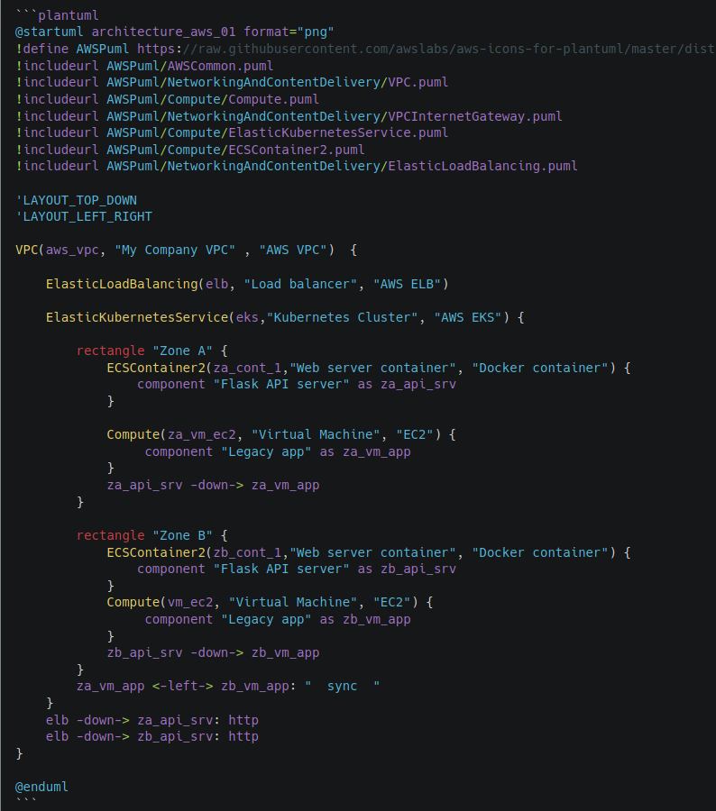

# mddoc
markdown to pdf converter with plantuml support and merge multiple md files


## Introduction

mddoc is a tool to convert markdown document to pdf.
A python script merge multiple md files into one single md file, then it converts to pdf using pandoc and wkhtmltopdf.

mddoc support plantuml diagram. (see project https://plantuml.com)

You can customize the first page and header/ footer page of the pdf document using html template.

Also, the Docker image includes project mkdocs (https://www.mkdocs.org/). So you can convert the markdown file into pdf 
and readthedoc format using the same configuration file and Docker image.


## Main features

Generated pdf are formal, 


**Fisrt page:**


Properties are automatically updated: 


**Page Header:**


**Page Footer:**


**Change record:**

It lists automatically all the tags


**Plantuml support:**

From embedded code on md file:



Provides a nice diagram:


**Beautiful code:**


**Pdf metadata**

Very usefull if you store the pdf file on Microsoft OneDrive or Google Drive, 
you can specify key words in pdf metadata:


## Installation

To avoid compilation, you can use script `convert2pdf`, it uses a Docker image `https://hub.docker.com/repository/docker/eguisse/mddoc`


### Using the existing Docker image

```bash
docker pull eguisse/mddoc:latest

docker run -it --rm -v "$(CURRENT_DIR):/mnt:rw" "mddoc:latest" bash makepdf.sh -d docs -b build -o build/mddoc-docker-test.pdf -r src/resources -f mddoc.yml
```

Also, you could use script `[convert2pdf](convert2pdf)`


## Convert markdown file to pdf

Requirements:

- Bash (on Linux, MacOS, Windows Subsystem for Linux (WSL) )
- Docker engine (see https://www.docker.com/)


1. create mddoc.yml file.

This configuration file is compatible with project mkdocs (https://www.mkdocs.org/). 

See example: [mddoc.yml](mddoc.yml)


2. Run Command:

```bash
./convert2pdf -d docs -b build -o build/output_file.pdf -r src/resources -f mddoc.yml -p $(HOME)/myproject
```


Or if you want to use the docker:

```bash
docker run -it --rm -v "$(PROJECT_DIR):/mnt:rw" "mddoc:latest" bash makepdf.sh -d docs -b build -o build/mddoc-docker-test.pdf -r src/resources -f mddoc.yml
```

List of options:

-h:  print the help message
-b:   build path, by default PROJECT_PATH/build
-d:   doc path, by default PROJECT_PATH/doc
-f:   config file, by default PROJECT_PATH/doc/mddoc.yml
-l:   Logging configuration File
-o:   pdf output file name
-p:   project path: mandatory option
-r:   resource path
-s:   site path by default PROJECT_PATH/build/site
-v:   print version


## Customize the document

You can create your own resources:

- First Page
- Header
- Footer
- CSS
- LUA Filter
- Markdown to html filter.


How to do it:

Copy files in path `src/resources` from the mddoc project

Then copy to your project.

when running command `convert2pdf` , specify the option `-r` where the resource files are located.

Modify the file as your needs.


## Build the docker image mddoc


### Compile binaries and Build the Docker image.

Building the Docker image is long, because we compile plantuml, pandoc, wkhtmltopdf and graphviz from code source.

0. Clone the reposiry

```bash
git clone https://github.com/eguisse/mddoc.git
```


1. Build wkhtmltopdf 

```bash
make build-wkhtmltopdf:
```

it takes ~ 30 minutes


2. Build plantuml

```bash
make build-plantuml
```


3. Build Docker image

Edit file `config.env` if needed

```bash
make build-docker-image
```


4. Publish on your repo

```bash
make publish
```


### Automatic build using github workflow

See file [.github/workflows/docker-build-actions.yml](.github/workflows/docker-build-actions.yml)

Build status: 

