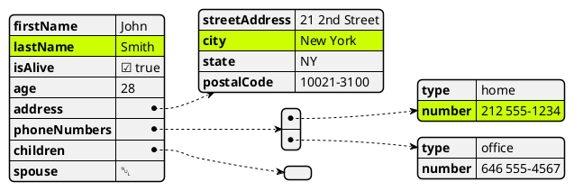
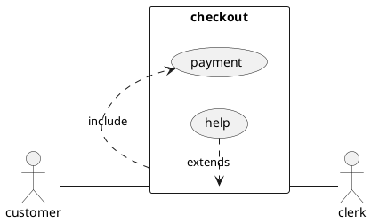
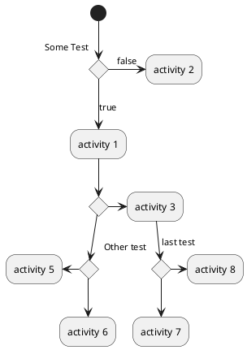
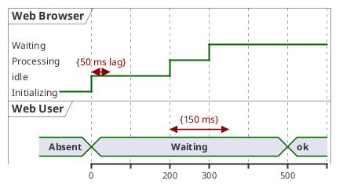
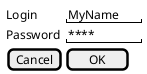
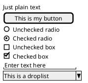
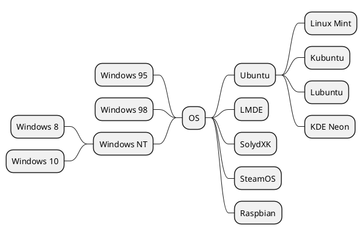
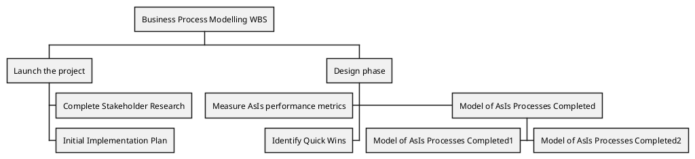

# Plantuml diagrams

This chapter shows some example of plantuml diagrams 

## Json 

doc ref: https://plantuml.com/fr/json 

## Uses case

doc ref: https://plantuml.com/fr/use-case-diagram

## Activity

## Time

## Salt

### Login Page

### Components

## Mindmap

## Work Breakdown Structure

``end of chapter.``
