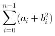
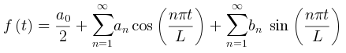

# Example of process


Few examples of plan uml process


## plan uml example  1

```plantuml
Bob -> Alice : hello
Alice -> Bob : Go Away
```

## plan uml example  2

```plantuml
autonumber "<b>[000]"
Bob -> Alice : Authentication Request
Bob <- Alice : Authentication Response

autonumber 15 "<b>(<u>##</u>)"
Bob -> Alice : Another authentication Request
Bob <- Alice : Another authentication Response

autonumber 40 10 "<font color=red><b>Message 0  "
Bob -> Alice : Yet another authentication Request
Bob <- Alice : Yet another authentication Response

```


## plan uml example 3

```plantuml
start
:Init Phase;
:Transfer Phase;
note right
  long running activity,
  process requires signal to proceed
end note
:Termination Phase;
stop
```


## PlantUML diagram with AWS architecture


```plantuml
@startuml architecture_aws_01 format="png"
!define AWSPuml https://raw.githubusercontent.com/awslabs/aws-icons-for-plantuml/master/dist
!includeurl AWSPuml/AWSCommon.puml
!includeurl AWSPuml/NetworkingAndContentDelivery/VPC.puml
!includeurl AWSPuml/Compute/Compute.puml
!includeurl AWSPuml/NetworkingAndContentDelivery/VPCInternetGateway.puml
!includeurl AWSPuml/Compute/ElasticKubernetesService.puml
!includeurl AWSPuml/Compute/ECSContainer2.puml
!includeurl AWSPuml/NetworkingAndContentDelivery/ElasticLoadBalancing.puml

'LAYOUT_TOP_DOWN
'LAYOUT_LEFT_RIGHT

VPC(aws_vpc, "My Company VPC" , "AWS VPC")  {

    ElasticLoadBalancing(elb, "Load balancer", "AWS ELB")

    ElasticKubernetesService(eks,"Kubernetes Cluster", "AWS EKS") {

        rectangle "Zone A" { 
            ECSContainer2(za_cont_1,"Web server container", "Docker container") {
                component "Flask API server" as za_api_srv
            }
     
            Compute(za_vm_ec2, "Virtual Machine", "EC2") {
                 component "Legacy app" as za_vm_app
            }
            za_api_srv -down-> za_vm_app
        }

        rectangle "Zone B" { 
            ECSContainer2(zb_cont_1,"Web server container", "Docker container") {
                component "Flask API server" as zb_api_srv
            }        
            Compute(vm_ec2, "Virtual Machine", "EC2") {
                 component "Legacy app" as zb_vm_app
            }
            zb_api_srv -down-> zb_vm_app
        }
        za_vm_app <-left-> zb_vm_app: "  sync  "
    }
    elb -down-> za_api_srv: http
    elb -down-> zb_api_srv: http
}

@enduml
```


## image png

Below an example of png image


## image svg

Below an example of svg image


## Equation using latex



### Mathjax 

Example:




### draw.io diagram

Example:


end of file.
